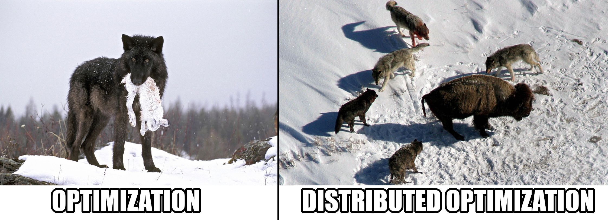

<h1 align="center">Communication-efficient distributed optimization
</h1>



With the growing number of distributed computations, the need for optimal
distributed algorithms has increased. The benefit from distributed computations
is clear, as we multiply the computing powers, thus reducing the computation
time, and allow processing of data containing an extreme number of features.
But there is a significant overhead caused by the network communication.
New optimization methods and algorithms are to solve the problem introduced by
the communication expenses.

## The goal

This work aims to implement and compare some of the most popular distributed
convex optimization algorithms:

- ADMM (centralized),
- DANE (centralized),
- Network-DANE (decentralized),
- Network-SARAH (decentralized),
- etc

in solving the problem of multi-label classification on
[fashion MNIST](https://github.com/zalandoresearch/fashion-mnist).

## The results

You can read the detailed report in [docs/report.pdf](./docs/report.pdf)

## Running benchmark

To run the benchmark:

1. Create a virtual environment:
```bash
virtualenv .venv
source .venv/bin/activate
```

2. Install requirements using pip
```bash
pip3 install -r requirements.txt
```

3. Run the main script
```bash
python3 main.py
```

## Contributors

- [Mikhail Shishatskiy](https://github.com/Shishqa)
- [Aleksei Volkov](https://github.com/AlgebraicWolf)

## Sources
- [Samy Wu Fung et. al. *ADMM-SOFTMAX : An ADMM Approach for Multinomial Logistic Regression*](https://onlinelibrary.wiley.com/doi/full/10.1002/asjc.2284)
- [Boyd et al. *Distributed Optimization and Statistical Learning Via the Alternating Direction Method of Multipliers*](https://books.google.ru/books?hl=ru&lr=&id=8MjgLpJ0_4YC&oi=fnd&pg=PA1&dq=Distributed+Optimization+and+Statistical+Learning+Via+the+Alternating+Direction+Method+of+Multipliers&ots=W4Q5orVFjP&sig=pzBpcD29WgITcVtBXxNxHlTsDzE&redir_esc=y#v=onepage&q&f=false)
- [Shamir et al. *Communication-Efficient Distributed Optimization using an Approximate Newton-type Method*](http://proceedings.mlr.press/v32/shamir14.pdf)
- [Boyue et al. *Communication-Efficient Distributed Optimization in Networks with Gradient Tracking and Variance Reduction*](http://proceedings.mlr.press/v108/li20f/li20f.pdf)
